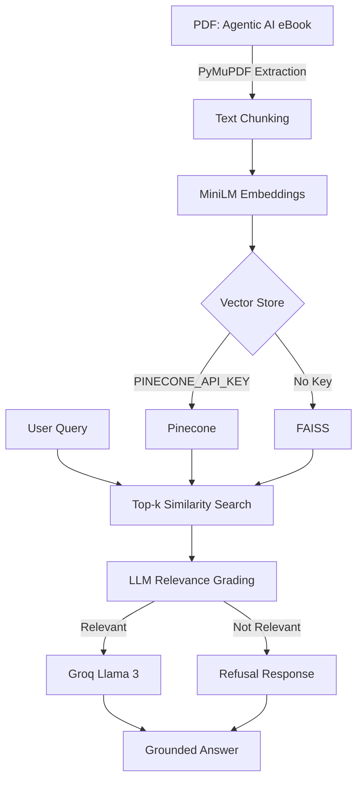

# 📘 Agentic AI eBook — RAG Chatbot

A Retrieval-Augmented Generation (RAG) chatbot that answers questions **strictly from a single source document**—Konverge AI's *Agentic AI: An Executive's Guide* eBook. Instead of hallucinating, the chatbot answers only from the retrieved document context. If the requested information is unavailable, it responds with a refusal rather than generating unsupported content.


# Screenshots

📂 [View Screenshots](https://github.com/ShivaliGupta17/agentic-ai-rag/tree/main/screenshots)

---

## Table of Contents

1. [Overview](#overview)
2. [Architecture](#architecture)
3. [Setup Instructions](#setup-instructions)
4. [Running the Chatbot](#running-the-chatbot)
5. [Sample Queries](#sample-queries)
6. [Project Structure](#project-structure)
7. [Deployment](#deployment)

---

# Overview

| Component | Description |
|-----------|-------------|
| **Source Document** | Konverge AI's *Agentic AI: An Executive's Guide* (PDF) |
| **Embeddings** | `sentence-transformers/all-MiniLM-L6-v2` |
| **Vector Store** | Pinecone (Serverless) with automatic FAISS fallback |
| **Workflow** | LangGraph (`retrieve → grade → generate`) |
| **LLM** | Groq `llama-3.1-8b-instant` |
| **Backend** | FastAPI |
| **Frontend** | Streamlit |
| **Hallucination Prevention** | LLM-based relevance grading + grounded prompt |

This project implements a Retrieval-Augmented Generation (RAG) pipeline that answers questions using only the provided eBook. Every response is grounded in retrieved document chunks. If the requested information is not available in the document, the chatbot returns a refusal instead of generating an unsupported answer.

---

# Architecture



### Document Ingestion

The PDF is processed page-by-page using **PyMuPDF**. Each page is split into overlapping chunks using LangChain's `RecursiveCharacterTextSplitter`, ensuring contextual continuity between chunks.

### Embedding Generation

Each chunk is converted into a vector using the local embedding model:

```
sentence-transformers/all-MiniLM-L6-v2
```

Since embeddings are generated locally, no embedding API key is required.

### Vector Store

The project supports two vector databases:

- **Pinecone (Serverless)**
- **FAISS (Automatic Local Fallback)**

Both expose the same interface through `vector_store.py`.

### LangGraph Workflow

The chatbot follows four stages:

- **Retrieve** – Retrieves Top-k relevant chunks.
- **Grade** – Uses the LLM to remove irrelevant chunks.
- **Generate** – Produces an answer using only the filtered context.
- **Fallback** – Returns a refusal when no relevant information exists.

---

# Setup Instructions

## 1. Clone the Repository

```bash
git clone https://github.com/<your-username>/agentic-ai-rag.git

cd agentic-ai-rag
```

## 2. Create a Virtual Environment

Windows

```bash
python -m venv venv

venv\Scripts\activate
```

Linux / macOS

```bash
python -m venv venv

source venv/bin/activate
```

## 3. Install Dependencies

```bash
pip install -r requirements.txt
```

## 4. Configure Environment Variables

Copy the environment template:

```bash
cp .env.example .env
```

Edit `.env`

```env
GROQ_API_KEY=your_groq_api_key
PINECONE_API_KEY=your_pinecone_api_key
```

Leave `PINECONE_API_KEY` empty to automatically use FAISS.

## 5. Build the Vector Index

```bash
python ingest.py
```

The ingestion process:

- Downloads the PDF
- Extracts text
- Splits into chunks
- Generates embeddings
- Stores vectors

Re-running the script is safe because it skips ingestion if the vector store already exists.

---

# Running the Chatbot

## Option 1 – Streamlit

```bash
streamlit run streamlit_app.py
```

Open:

```
http://localhost:8501
```

Features:

- Chat interface
- Confidence score
- Retrieved document chunks
- Conversation history

---

## Option 2 – FastAPI

```bash
uvicorn api:app --reload
```

API Endpoint

```
POST /chat
```

Request

```json
{
  "query": "What is Agentic AI?"
}
```

Response

```json
{
  "answer": "...",
  "confidence": 0.71,
  "context_chunks": [
    {
      "page": 2,
      "score": 0.71,
      "text": "..."
    }
  ]
}
```

---

# Sample Queries

| Query | Purpose |
|--------|---------|
| What is Agentic AI? | Definition retrieval |
| How is Agentic AI different from an LLM? | Comparison |
| Which industries are discussed? | Information extraction |
| What productivity improvement is mentioned? | Numeric retrieval |
| What are the seven layers of a multi-agent architecture? | Structural retrieval |
| What is the capital of France? | Hallucination prevention |

---

# Project Structure

```text
agentic-ai-rag/
├── api.py
├── ingest.py
├── rag_graph.py
├── vector_store.py
├── streamlit_app.py
├── requirements.txt
├── sample_queries.md
├── .env.example
├── README.md
└── data/
```

| File | Description |
|------|-------------|
| `ingest.py` | Downloads the PDF, creates chunks, generates embeddings, and stores vectors |
| `vector_store.py` | Common abstraction for Pinecone and FAISS |
| `rag_graph.py` | LangGraph workflow (`retrieve → grade → generate`) |
| `api.py` | FastAPI backend |
| `streamlit_app.py` | Streamlit chat interface |
| `sample_queries.md` | Example queries and outputs |

---

# Deployment

## Hugging Face Spaces

- Choose the **Streamlit SDK**
- Push this repository
- Add `GROQ_API_KEY` as a repository secret
- Optionally add `PINECONE_API_KEY`
- Run `python ingest.py` once before serving

## Render

Deploy the FastAPI application using:

```bash
uvicorn api:app --host 0.0.0.0 --port $PORT
```

Run `python ingest.py` during deployment so the vector database is populated before the application starts.

---

This project demonstrates a production-style Retrieval-Augmented Generation (RAG) pipeline with LangGraph orchestration, Groq Llama 3 integration, Pinecone/FAISS vector search, LLM-based relevance grading, and grounded answer generation to minimize hallucinations.
